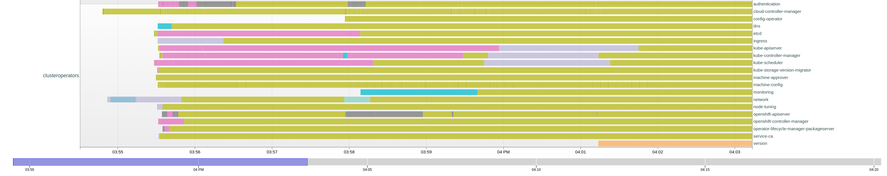

# sno-ibu-measurements

The Startup time can be fitted into 4 categories:

1. Metal Startup Time (from turning on the Power until BIOS/UEFI bootloader delegates to linux kernel)
2. RHCOS Startup Time (from linux kernel load until systemd is starting the kubelet)
3. OpenShift Startup Time (from kubelet start until API Server availability)
4. OpenShift Readiness Time (from API Server availability until all operators are ready and available)

Focus on this measurement will be 2-3, as 4 is still being worked on with Readiness Checks in LCA and 1 is extremely Hardware dependant and should
be measured separately. It should be noted that UEFI boot time optimization options are likely small or impossible.

## systemd analysis

1. uptime: 2023-11-28 14:50:48 - This is the start of RHCOS kernel
2. Startup finished in 2.782s (kernel) + 8.444s (initrd) + 4min 19.162s (userspace) = 4min 30.389s graphical.target reached after 4min 19.061s in userspace
3. This means that the systemd services are done at 2023-11-28 14:55:18
   * From systemd-analyze, we can observe that the kubelet service is started 3 minutes after systemd initialization
   * This means the previous time is consumed by other blocking services
   * The biggest blocking service is the installation configuration service, which takes 3m10s to complete
   * Other important services are 
     * kdump (40s), 
     * NetworkManager-wait-online (55s), 
     * restorecon-var-lib-containers (18s)
   * More details can be found in the [systemd-analyze](systemd-analyze-plot.html) file
4. Interestingly, `installation-configuration.service` starts 78seconds after kernel initialization.
5. As one can see the initial wait time of 78seconds added to the 3m10s time of installation-configuration service provide the critical path.

In total we spend:
1. 3 seconds in kernel initialization (+ firmware)
2. 8 seconds for loading necessary boot files into RAM
3. 4 minutes and 19 seconds in userspace until the kubelet is fully started and the post-pivot work of the installation-configuration service is complete

What we can see from the blame graph is that installation-configuration.service is a clear bottleneck and should be sped up as much as possible.
Any currently serialized operations within this should be parallelized if possible and any waiting (e.g. CSR waiting process should be avoided).

### [installation-configuration.service](installation-configuration.service.log)

Deeper Analysis of the installation-configuration.service shows that the main bottleneck is condensed to the following parts:

1. recert (14:53:08-14:53:09) took 1 minute indicating a clear bottleneck in either the indexing process other parts. We should aim for parallelizing this step inside the run.
2. kubelet enabling (14:53:09-14:54:07) took 58 seconds and likely cnanot be optimized without help from the apiserver team
3. apiserver waiting (14:54:07-14:54:25) took 18 seconds until API server is available ("waiting for api")
4. approving kubelet-servicng csr (14:54:25-14:55:15), took 50 seconds and should ideally be handled in the recert process instead of waiting here if possible.

Getting rid of some of the recert runtime (1min) and the kubelet-servicing csr (50s)
would result in almost 2Minutes of saved time during bootup.

After this gains from other components are likely not resulting in much gain due to NetworkManager-wait-online and kdump needing at least 1 minute to get online
and providing the next optimization point.

### Other noteful observations

* restorecon-var-lib-containers.service is taking 18 seconds and should be investigated if this can be sped up.
* The first user session (user 1000 / core) is initialized 60 seconds after kernel load time. It should be investigated if this can be sped up.
* installation-configuration.service and ovs-configuration.service are both started 20 seconds after user core is loaded. It should be investigated if this can be sped up.
* A dependency of installation-configuration.service to NetworkManager-wait-online.service should be avoided at all costs as it increases the critical path by about a minute.

### Observations related to recert

When looking at the recert process, we can see that the following optimizations might help reduce timings:

So to summarize recert-related findings from your analysis:
* One might want to precalculate RSA keys for recert, or run recert during SNOA, to avoid the 40-60 seconds penalty we have for recert
* One should use recert to re-sign the kubelet certs and change their hostname, to avoid CSR approval phase
* One should use recert to calculate and edit the annotation hashes we discovered in the [API Server Replica Set Revision](apiserver-revisions) as this currently leads to extra restarts.

## API Server Availability Analysis

To measure the API Server availability, I used [fastsno](https://github.com/omertuc/fastsno/tree/main) which was originally used for installation measurements.
However, to fit to our use case, I adjusted the APIServer Audit Logging Level in the seed cluster so that they would automatically be captured when the recipient APIServer came up again after the upgrade.

The result is a new graph that starts measuring from the very bootup of the kubelet to the point where the API Server is available again:

As one can see in the chart, the API Server Audit Logs start exactly at 14:54, which is the original time when RHCOS booted (14:50:48) + the time until the kubelet started (2023-11-28 14:54:07 inside installation-configuration.service, where kubelet is enabled)

After this one can see that it takes most smaller controllers until 14:56:30, which is 2 minutes and 23 seconds after the kubelet started, to be ready.

However, we have several components that take significant time to become available:

1. etcd takes until 14:58:08, which is 4 minutes after the kubelet started to report availability.
2. kube-apiserver & kube-controller-manager take until 15:00 respectively to become available (5 minutes after kubelet starts) but under an old NodeRevision, and only get to the correct NodeRevision at 15:02, which is also when the cluster version reports "DoneProgressing"

### Summary

1. Overall it takes around 5 minutes to reach stable API Server availability in the correct Node Revision. It is unclear to me why we even have a new node revision and this should likely be targeted for RCA
2. From the Start of RHCOS (14:54) to the NodeInstallerProgressing Condition being at the correct revision and inactive (15:02) we spend around 8 minutes. This is a boot time without leases and with all objects in place.
3. It seems apparent from the startup graph that there has been a retry in some installer pods (`installer-10-retry-1`) in openshift-kube-apiserver that is most likely a huge time loss and should be investigated.
4. It also seems apparent that there is a significant delay from the start of openshift-authentication to the start of openshift-sriov-network-operator. This should be investigated as well.

## Total Time

The total time from the start of RHCOS until the cluster is ready is over 12 minutes as of this test. Together with more metal boot time and Telco operators + custom readiness conditions that are available post API Server we are looking at least at 15 minutes for reliable startup.