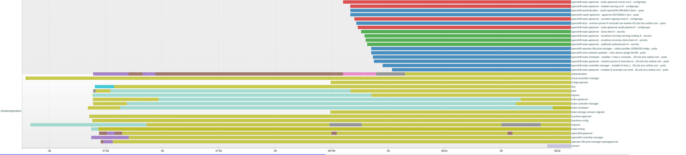

# sno-ibu-measurements

The Startup time can be fitted into 4 categories:

1. Metal Startup Time (from turning on the Power until BIOS/UEFI bootloader delegates to linux kernel)
2. RHCOS Startup Time (from linux kernel load until systemd is starting the kubelet)
3. OpenShift Startup Time (from kubelet start until API Server availability)
4. OpenShift Readiness Time (from API Server availability until all operators are ready and available)

Focus on this measurement will be 2-3, as 4 is still being worked on with Readiness Checks in LCA and 1 is extremely Hardware dependant and should
be measured separately. It should be noted that UEFI boot time optimization options are likely small or impossible.

## Gains compared to 28-11-23

1. 50 seconds gained in userspace time (3m29s vs 4m19s) due to CSR approval being skipped
2. Total startup reduced to ~8m30s until ClusterVersion readiness from Kernel Initialization to ClusterVersion readiness
3. Combined with an estimated ~1m kubelet shutdown, ~3m of UEFI boot time and ~3m for Telco Day2 Operators (accurate measurements pending) we are looking at ~13-15m from the trigger of the Upgrade to full availability again

## systemd analysis

1. uptime: 2023-12-07 18:53:35- This is the start of RHCOS kernel
2. Startup finished in 2.838s (kernel) + 7.453s (initrd) + 3min 29.142s (userspace) = 3min 39.433s graphical.target reached after 3min 29.071s in userspace.
   * NOTE: Compared to the Measurements from 28-11-23, we have a 50 second improvement in userspace time.
3. This means that the systemd services are starting at 18:53:35, whereas kubelet starts at 18:56:53
   * From systemd-analyze, we can observe that the kubelet service is started 3 minutes after systemd initialization
   * This means the previous time is consumed by other blocking services
   * The biggest blocking service is the installation configuration service, which takes 2m20s to complete
   * Other important services are 
     * kdump (40s), 
     * NetworkManager-wait-online (55s), 
     * restorecon-var-lib-containers (18s)
   * More details can be found in the [systemd-analyze](systemd-analyze-plot.html) file
4. Interestingly, `installation-configuration.service` starts 78seconds after kernel initialization.
5. As one can see the initial wait time of 78seconds added to the 3m10s time of installation-configuration service provide the critical path.

In total we spend:
1. 3 seconds in kernel initialization (+ firmware)
2. 8 seconds for loading necessary boot files into RAM
3. 3 minutes and 30 seconds in userspace until the kubelet is fully started and the post-pivot work of the installation-configuration service is complete

What we can see from the blame graph is that installation-configuration.service is a clear bottleneck and should be sped up as much as possible.
Any currently serialized operations within this should be parallelized if possible and any waiting (e.g. CSR waiting process should be avoided).

### [installation-configuration.service](installation-configuration.service.log)

Deeper Analysis of the installation-configuration.service shows that the main bottleneck is condensed to the following parts:

1. recert (18:54:55-18:55:56) took 1 minute indicating a clear bottleneck in either the indexing process other parts. We should aim for parallelizing this step inside the run.
2. kubelet enabling (18:55:56-18:56:54) took 58 seconds and likely cannot be optimized without help from the apiserver team
3. apiserver waiting (18:56:54-18:57:11) took 16 seconds until API server is available ("waiting for api")
4. approving the kubelet CSR got skipped and reduced in the 50 minute timesavings compared to previous measurements

Getting rid of some of the recert runtime (1min) should still be a priority.

After this gains from other components are likely not resulting in much gain due to NetworkManager-wait-online and kdump needing at least 1 minute to get online
and providing the next optimization point.

### Other noteful observations

* restorecon-var-lib-containers.service is not gonna be optimizable and will lead to inevitably 18 seconds of runtime.
* installation-configuration.service and ovs-configuration.service are both started 20 seconds after user core is loaded. It should be investigated if this can be sped up.
* A dependency of installation-configuration.service to NetworkManager-wait-online.service should be avoided at all costs as it increases the critical path by about a minute.

### Observations related to recert

When looking at the recert process, we can see that the following optimizations might help reduce timings:

So to summarize recert-related findings from your analysis:
* One might want to precalculate RSA keys for recert, or run recert during SNOA, to avoid the 40-60 seconds penalty we have for recert
* One should use recert to re-sign the kubelet certs and change their hostname, to avoid CSR approval phase
* One should use recert to calculate and edit the annotation hashes we discovered in the [API Server Replica Set Revision](apiserver-revisions) as this currently leads to extra restarts.

## API Server Availability Analysis

As can be seen in the extended API Server availability analysis, we face issues with rollouts of the components in `openshift-kube-apiserver`. 
The revisions lead to the following new secrets/configmaps:
- kube-apiserver-audit-policies-8
- etcd-client-8
- localhost-recovery-serving-certkey-8
- localhost-recovery-client-token-8
- webhook-authenticator-8
- sa-token-signing-certs-8
- kubelet-serving-ca-8
- kube-apiserver-server-ca-8

These are all related to base domain changes in the original certificates. After the Post-Pivot this changes to the recipient cluster
and causes regeneration. This means that Recert/LCA has to take care of this to avoid additional rollouts and we will in total likely save 2-3 minutes of runtime.

On top of this, we can observe an early additional ETCD rollout. this additional etcd rollout causes around 15 seconds of startup time.

### Summary

1. Overall it takes around 5 minutes to reach stable API Server availability in the correct Node Revision. It is unclear to me why we even have a new node revision and this should likely be targeted for RCA
2. From the Start of RHCOS (14:54) to the NodeInstallerProgressing Condition being at the correct revision and inactive (15:02) we spend around 8 minutes. This is a boot time without leases and with all objects in place.
3. It seems apparent from the startup graph that there has been a retry in some installer pods (`installer-10-retry-1`) in openshift-kube-apiserver that is most likely a huge time loss and should be investigated.
4. It also seems apparent that there is a significant delay from the start of openshift-authentication to the start of openshift-sriov-network-operator. This should be investigated as well.
